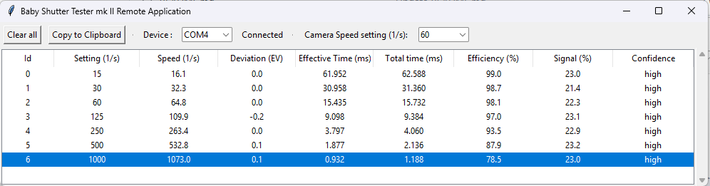

# bst_remote_apps
Reference remote applications for collecting data from the Baby Shutter Tester device  
These application use the data transmitted by device to display and collect relevant information. The format of these data are described in the [wiki](https://github.com/sebastienroy/bst_remote_apps/wiki).  

## Personal computer application

  

The reference application for personal computer is a Python application.  

- Download the python file : https://github.com/sebastienroy/bst_remote_apps/blob/main/pc/bst_remote_app.py
- install the requirement packages
- double click on the downloaded python file

Requirements:  
- Python sdk is installed
- the pyserial library has been installed using pip

See https://github.com/sebastienroy/shutter_lover_remote_app for the description of the installation of Python and PySerial package

## Android application

The Android application is available as an Android Studio project.  
https://github.com/sebastienroy/bst_remote_apps/tree/main/android/BabyShutterTesterViewer  

The application is currently not available in Android Play Store.  You have to build it using Android Studio, then upload it in your Android Phone (developper mode required).  

